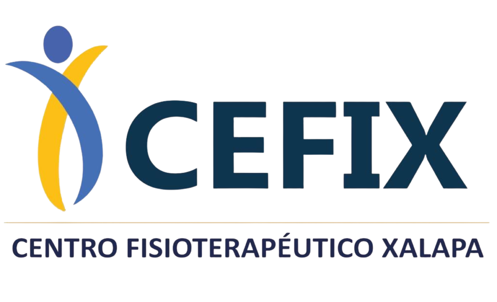

  

<h2 align="center">CEFIX · Web App Clínica</h2>

  Aplicación web para orientación, agendado de citas y recomendación de sucursal
  para un centro de fisioterapia con dos sedes.

---

## 🏥 Descripción

**CEFIX Web App** es una aplicación clínica diseñada para mejorar la experiencia de pacientes
al momento de:

- Orientarse entre **urgencia** o **cita programada**
- Recibir recomendaciones de **sucursal** según zona y contexto
- Agendar citas sin necesidad de login (MVP)
- Confirmar atención vía **WhatsApp**
- Consultar **servicios**, **videos terapéuticos** y **sucursales**

La app prioriza una estética **profesional, clínica y confiable**, con un chatbot conversacional
que guía al usuario paso a paso (sin realizar diagnósticos).

---

## ✨ Features (MVP)

- 🤖 Chatbot conversacional con animaciones suaves
- 🏥 Derivación inteligente por sucursal (Museo / Araucarias)
- 📅 Agendado de cita sin registro
- 💬 Confirmación vía WhatsApp
- 📱 Diseño responsive (mobile-first)
- 🎨 UI alineada a identidad visual de CEFIX
- ⚠️ Sin diagnósticos médicos (orientación únicamente)

---

## 🛠️ Stack Técnico

- **Next.js (App Router)**
- **React**
- **TypeScript**
- **Tailwind CSS**
- **SSR / Streaming**
- Arquitectura sin base de datos (MVP escalable)

---

## 🚀 Roadmap (próximo)

- Integración con **Google Calendar** para disponibilidad real
- Historial de conversación persistente
- Panel interno para staff
- Recordatorios automáticos
- Sistema completo de citas (fase 2)

---

## 👨‍💻 Autor

Desarrollado por **Rodolfo “Rudi” Carrillo**  
Full Stack Developer · Product Builder

- 🌐 Portafolio: https://rudicarrillo.com  
- 💼 LinkedIn: https://www.linkedin.com/in/rudi-carrillo  

---

## ⚠️ Aviso

Esta aplicación **no realiza diagnósticos médicos**.  
Ante dolor intenso, lesiones recientes o emergencias, se recomienda acudir a atención inmediata.

---

  © CEFIX · Centro Fisioterapéutico

